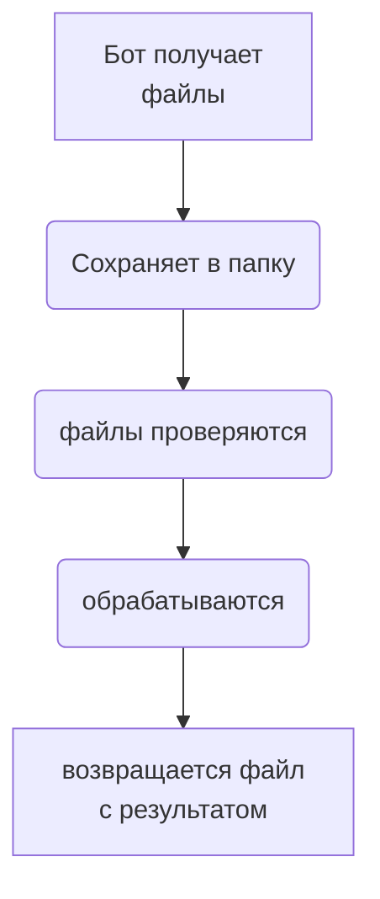

# RPA_telegram

### Create python venv
```bash
python -m venv venv && . venv/Scripts/activate
pip install -r requirements.txt 
```
### Create file input
```bash
vim input
```
### add in file/input 
#### TOKEN = "yor token telegram bot"
#### CHAT_ID = "you number chat"
#### PATH_FOLDER = "folder for saving documents"

#### training materials
https://docs.aiogram.dev/en/latest/dispatcher/finite_state_machine/index.html

репа от видео youtube
https://github.com/nkorgik/AiogramBotLessons/blob/master/intermediate_level/fsm_dialogs.py

[Exsample training aiogram3](https://mastergroosha.github.io/aiogram-3-guide/filters-and-middlewares/)

[Создание диаграмм github](https://habr.com/ru/articles/652867/) # Хабр

[documentations diogramms github](https://docs.github.com/ru/get-started/writing-on-github/working-with-advanced-formatting/creating-diagrams)

[documentations telegramm](https://core.telegram.org/bots/api#sending-files)

### Exsample code aiogrm on github
[orders bot](https://github.com/darksidecat/orders_bot/blob/master/redis.conf)

[cost_confirmation_bot](https://github.com/darksidecat/cost_confirmation_bot/blob/main/app/tgbot/filters/access_level.py)

[Shvatka](https://github.com/bomzheg/Shvatka/blob/master/shvatka/tgbot/models/hint.py)

## scheme

